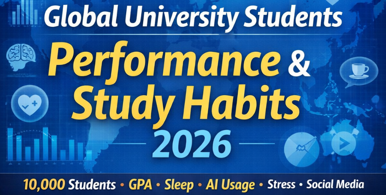

# Data Analysis on Student Performance

## Introduction

In this data analysis project, we will be analyzing a dataset containing information regarding University students' lifestyle and study habits, and understanding how different factors, such as lifestyle, habits, demographics, technology usage, and socioeconomic status, influences academic performance and success.

---

## Tools Used

In this project, we will make extensive use of the **Python** programming language. We will use Jupyter Notebooks.

We will be using Python and libraries like `numpy` and `pandas` to analyze and clean, if necessary, the dataset.

We will also use data visualization libraries, such as `matplotlib` and `seaborn`.

We will also use a machine learning library, primarily `scikit-learn` (`sklearn`) for predictive analysis.

---

## Dataset

The dataset we will be using for this analysis is available on Kaggle.
All credit goes to the respective owners and creators.

The link to the dataset: [University Students Performance and Study Habits](https://www.kaggle.com/datasets/asifxzaman/university-students-performance-and-study-habits2026)

---

## Repository Structure

- `data`: Contains the dataset used for this data analysis
- `notebooks`: Directory for all Jupyter Notebooks, for analysis and storytelling
- `reports`: Final outputs, visuals, summaries, presentations

---

## Links

To be updated...
